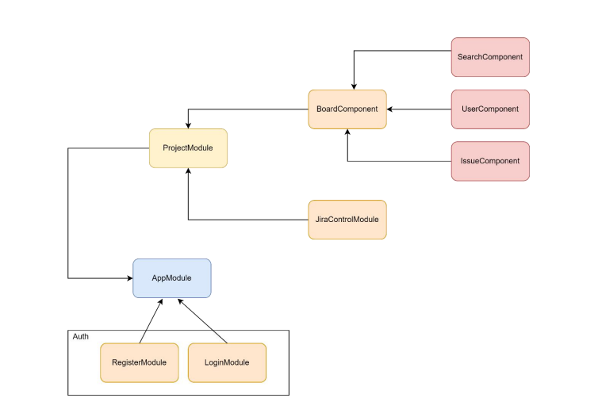
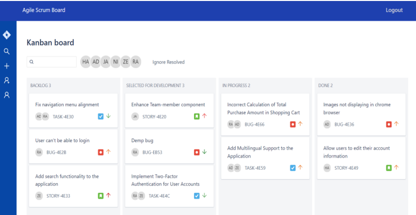
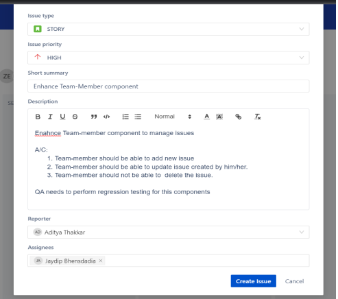
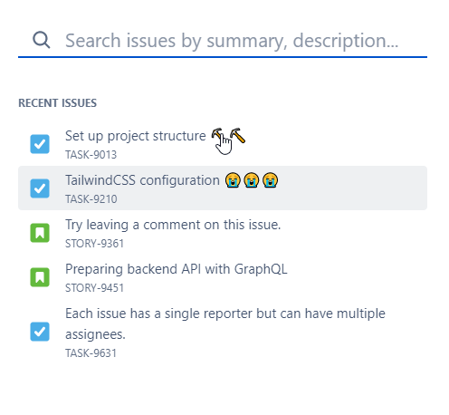

# Agile Scrum Board

## Project Overview
The **Agile Scrum Board** is a web-based project management tool that facilitates agile methodologies, allowing teams to collaborate, manage workflows, and track the progress of tasks efficiently. This tool provides a visual representation of the project’s tasks, which can be categorized into columns such as "To Do," "In Progress," and "Done," helping Scrum Masters and team members keep track of project goals and objectives.

## Features
- **Issue Management:** Create, edit, and track tasks across various stages of development.
- **User Management:** Add, remove, and manage team members.
- **Filtering Options:** Filter tasks by team member or by status to focus on the most relevant issues.
- **Password Recovery:** A secure mechanism for recovering forgotten passwords.
- **Search Functionality:** Easily find specific tasks by keywords.
- **Drag-and-Drop Interface:** Move tasks between stages using an intuitive drag-and-drop interface.

## Technologies Used
### Frontend:
- 
- 

### Backend:
- 
- 
- 

### Others:
- 
- 
- 

## System Architecture
The application follows a standard architecture where the frontend Angular application interacts with the backend Node.js & Express.js API, which, in turn, communicates with MongoDB to store and retrieve data.



## How to Run the Project

1. **Clone the repository:**
   ```bash
   git clone https://github.com/adityathakkar17/agile-scrum-board.git
   cd agile-scrum-board
   ```

2. **Install the dependencies:**
   For the frontend (Angular):
   ```bash
   cd frontend
   npm install
   ```

   For the backend (Node.js/Express.js):
   ```bash
   cd backend
   npm install
   ```

3. **Set up MongoDB:**
   - You can use MongoDB Atlas or run MongoDB locally.
   - Update the MongoDB URI in `backend/config/database.js`.

4. **Run the project:**
   To start both the frontend and backend:
   ```bash
   npm run start
   ```

5. **Navigate to the application:**
   Open a browser and go to `http://localhost:4200` to view the Agile Scrum Board.

## API Endpoints
- **Login:** `POST /api/auth/login`
- **Register:** `POST /api/auth/register`
- **Create Task:** `POST /api/tasks`
- **Update Task:** `PUT /api/tasks/:id`
- **Delete Task:** `DELETE /api/tasks/:id`
- **Get Tasks:** `GET /api/tasks`

## Home Page


## Add Issue


## View Issue


## Search Issues


## Testing
Unit testing is implemented using Jasmine for the Angular application. To run tests, execute the following in the `frontend` folder:
```bash
npm test
```

## Future Enhancements
- **Reporting and Analytics:** Add detailed reports for better insights into project trends and bottlenecks.
- **Integration with Time-Tracking Tools:** Integrate with third-party tools like time-tracking or invoicing software for enhanced efficiency.
- **Team Member Logins:** Expand the system to allow team members to manage their assigned tasks.
- **Customization Options:** Provide more configurable options to tailor the Scrum Board to different project needs.

## Acknowledgements
We would like to thank our mentors and colleagues at HHAeXchange for their continuous guidance and support during the project development.
